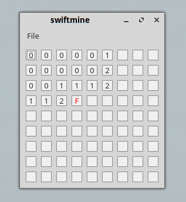

# swiftmine
Minesweeper with Swift 5 and [Qlift](https://github.com/Longhanks/Qlift "Qlift")

## Building

`swift build`

[Qlift](https://github.com/Longhanks/Qlift "Qlift") provides the *.ui file compiler, `qlift-uic`, which must be used to compile the files from the UI directory into Swift source files in the Sources directory. This must be repeated whenever the *.ui files are changed.

## Screenshot

